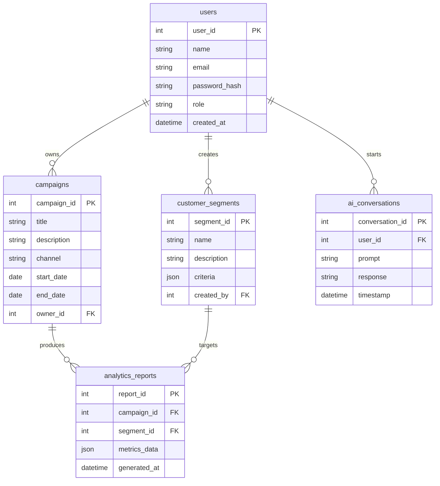

# Final Data Model Diagram

```mermaid
erDiagram
  users ||--o{ campaigns : owns
  users ||--o{ customer_segments : creates
  users ||--o{ ai_conversations : starts
  campaigns ||--o{ analytics_reports : produces
  customer_segments ||--o{ analytics_reports : targets

  users {
    int user_id PK
    string name
    string email
    string password_hash
    string role
    datetime created_at
  }

  campaigns {
    int campaign_id PK
    string title
    string description
    string channel
    date start_date
    date end_date
    int owner_id FK
  }

  customer_segments {
    int segment_id PK
    string name
    string description
    json criteria
    int created_by FK
  }

  analytics_reports {
    int report_id PK
    int campaign_id FK
    int segment_id FK
    json metrics_data
    datetime generated_at
  }

  ai_conversations {
    int conversation_id PK
    int user_id FK
    string prompt
    string response
    datetime timestamp
  }
```
